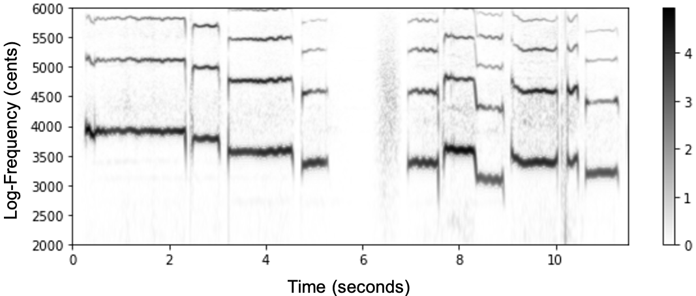
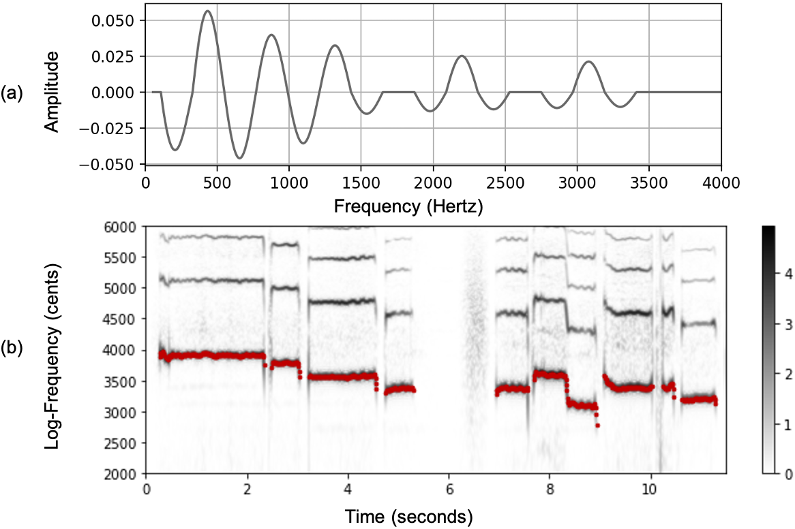

# Summary
The extraction of fundamental frequency (F0) information from music recordings is a crucial task in the field of music information retrieval (MIR). Typically, one needs to estimate the F0s over time that correspond to the played or sung melodic lines (also called F0-trajectories). In recordings with several instruments, the different sound sources overlap in frequency, making it  hard to identify the F0-trajectory of a specific instrument. This may lead to confusion of the F0 with harmonics (of other instruments) and undesired temporal discontinuities in the F0-trajectories. Over the last decades, various F0-estimation approaches have been proposed, ranging from model-based approaches (time- and frequency-domain processing) to deep learning approaches.
%
In this paper, we introduce a Python package called libf0 that provides open-source  implementations for four popular model-based F0-estimation approaches, YIN [@CheveigneK02_YIN_JASA], pYIN [@MauchD14_pYIN_ICASSP], an approach inspired by Melodia [@SalamonG12_MelodyExtraction_TASLP], and SWIPE [@CamachoH08_SawtoothWaveform_JASA]. Our toolbox offers reproducible baselines for developing and comparing F0-estimation algorithms for computational analysis of music recordings. Furthermore, our toolbox contains example code for visualizing and sonifying F0-trajectories to gain an intuitive understanding of the estimation results.

# Statement of need

F0-estimation in music recordings is a long-studied problem in the field of MIR since F0-trajectories often serve as mid-level representation [@BittnerSBB17_PitchContours_AES] for tasks such as automatic music transcription and performance analysis. Along with the scientific literature, one can find open-source implementations for many F0-estimation algorithms. For instance, there exist implementations in Python[^1] and Matlab[^2] for YIN, in Python[^3] and as Vamp-Plugin for pYIN[^4], in C++[^5] and as Vamp-Plugin for Melodia[^6] as well as in Matlab and C[^7] for SWIPE. However, there are two main challenges for reproducible research. First, for most existing implementations, the source cannot be cited or traced back, which can lead to reproducibility issues. This is particularly problematic since we found that different implementations of the same algorithm can vary significantly in performance and accuracy. Second, studies that require applying several algorithms jointly, e.g., fusion experiments [@RosenzweigSM21_F0Reliability_ICASSP] or comparative studies, are hard to conduct due to the diversity of programming languages and sources. To overcome these challenges, we created libf0, a central and citeable repository of reference implementations that can conveniently be used to apply, compare, and develop F0-estimation algorithms in a reproducible way.

[^1]: <https://librosa.org/doc/main/generated/librosa.yin.html>
[^2]: <http://audition.ens.fr/adc/>
[^3]: <https://librosa.org/doc/main/generated/librosa.pyin.html>
[^4]: <https://code.soundsoftware.ac.uk/projects/pyin>
[^5]: <https://essentia.upf.edu/reference/std_PredominantPitchMelodia.html>
[^6]: <https://www.upf.edu/web/mtg/melodia>
[^7]: <https://github.com/kylebgorman/swipe>

# F0-Estimation Algorithms

In the following, we briefly describe the algorithms included in libf0. To this end, we use an excerpt of a singing voice recording from the publicly available multitrack choral singing dataset "Dagstuhl ChoirSet" [@RosenzweigCWSGM20_DCS_TISMIR] as our running example. The recording was obtained from a soprano singer using a throat microphone. A spectrogram of the recording with logarithmic frequency axis (given in the unit cents with reference frequency 55 Hz) is shown in \autoref{fig:fund:logspec}.

## YIN

One of the most well-known algorithms for F0-estimation is YIN[^8], which was first introduced by [@CheveigneK02_YIN_JASA]. YIN is a time-domain algorithm, which produces one F0-estimate for each time frame following three main steps. In the first step, one computes a function referred to as *cumulative mean normalized difference function* (CMNDF). The CMNDF is depicted for one frame (of the first sung note) of our running example in \autoref{fig:fund:yinpyin}a. As one can see, the CMNDF has local minima at integer multiples of the period of the signal.
In the second step, one sets an absolute threshold and determines the smallest value of $\tau$ for which CMNDF has a local minimum deeper than that threshold. For our example frame, given a threshold as indicated by the red dotted line in \autoref{fig:fund:yinpyin}a, we obtain $\tau = 42$ samples, corresponding to a frequency of $Fs / \tau = 22050~\mathrm{Hz} / 42 = 525$ Hz (3905 cents for a reference frequency of 55 Hz). In the third step, the period estimate is refined using parabolic interpolation. \autoref{fig:fund:yinpyin}b depicts the log-frequency spectrogram superimposed with the F0-trajectory estimated by YIN for our running example. Since the algorithm does not enforce continuity of the estimated F0-trajectories, one often obtains highly fluctuating F0-estimates (e.g., see \autoref{fig:fund:yinpyin}b at around $6$ seconds). In particular, YIN suffers from confusion of the F0 with higher harmonics (especially the octave). For further information on the YIN algorithm, we refer to [@CheveigneK02_YIN_JASA].

[^8]: The name YIN stems from the Chinese philosophical concept "Yin" and "Yang".

## pYIN

Probabilistic YIN, or pYIN, introduced by [@MauchD14_pYIN_ICASSP], is a modification of the previously described YIN algorithm. To increase the robustness and alleviate the continuity problems of the YIN algorithm, the authors propose two main strategies. First, one applies YIN multiple times with different thresholds taken from a given threshold distribution. In this way, one obtains multiple F0-candidates per frame. Second, the authors introduce an additional temporal smoothing step. Using a hidden Markov model (HMM) and Viterbi decoding, the algorithm determines a smooth trajectory of F0-values from the F0-candidates. Furthermore, the HMM smoothing includes frame-wise decision of whether a frame is voiced or unvoiced (commonly referred to as *voicing detection*). \autoref{fig:fund:yinpyin}c shows the estimated pYIN-trajectory for our running example. As one can see, the outliers of the YIN-trajectory have been removed, and the estimated F0-trajectory is smooth. As a downside of pYIN, the algorithm is computationally more complex than YIN. For further information on the pYIN algorithm, we refer to [@MauchD14_pYIN_ICASSP].

## Salience-Based Approach

This approach is inspired by the Melodia algorithm introduced by [@SalamonG12_MelodyExtraction_TASLP]. Melodia is a frequency domain algorithm  that is primarily designed for the task of melody extraction (estimating the F0-trajectory of the predominant melodic line). Melodia relies on an enhanced time--frequency representation (also called *salience representation*) of the audio signal, which can be computed in four main steps. First, a short-time Fourier transform (STFT) is computed from the signal. Second, by making use of the phase of the complex Fourier-coefficients, the frequency resolution is refined using a technique referred to as *instantaneous frequency* (IF) estimation (see [@SalamonG12_MelodyExtraction_TASLP] and [@Mueller21_FMP_SPRINGER], Section 8.2.1, for details). Third, the IF-estimates are binned onto a logarithmic frequency axis. Fourth, one applies a technique called *harmonic summation*, which exploits the harmonicity of sounds by accumulating the harmonics of a tone over frequency. The refined log-frequency spectrogram for our running example and the working principle of harmonic summation are visualized in \autoref{fig:fund:melodia}a. The resulting salience representation is visualized in \autoref{fig:fund:melodia}b. As one can see, harmonic summation leads to replications of spectral patterns ("ghost components") appearing particularly in the lower frequency regions. To compute the F0-trajectory, our implementation uses a dynamic programming approach as described in [@Mueller21_FMP_SPRINGER], Section 8.2.1,. \autoref{fig:fund:melodia}b shows the F0-trajectory estimated by the salience-based approach for our running example. The robustness to the presence of other, non-predominant sound sources in the analyzed signal comes at the cost of increased computational complexity of the algorithm. For further information on the Melodia algorithm, we refer to [@SalamonG12_MelodyExtraction_TASLP].

## SWIPE

SWIPE (Sawtooth Waveform Inspired Pitch Estimator) is a frequency domain algorithm introduced by [@CamachoH08_SawtoothWaveform_JASA]. The algorithm relies on a correlation with pre-computed kernels in the frequency domain, which we explain in the following. In the first step, one constructs a kernel from several truncated and weighted cosine lobes for each F0-value from a set of F0-candidates. The kernel for a frequency of $440$~Hz is visualized in \autoref{fig:fund:swipe}a. As one can see, the kernel is constructed such that it has local maxima at prime multiples of the F0 with decreasing amplitude over frequency. Avoiding local maxima at non-prime harmonics helps to reduce confusion of the F0 with harmonics. In the second step, a time--frequency representation with logarithmic frequency resolution, similar to the one shown in \autoref{fig:fund:swipe}b, is computed. In the last step, one obtains the F0-estimate by finding the kernel that maximally correlates with the spectrum for each time frame. Additionally, the F0-estimate may be refined using parabolic interpolation.
\autoref{fig:fund:swipe}b shows the F0-trajectory estimated by SWIPE for our running example.
Note that SWIPE does not include an additional smoothing step. However, due to its robust kernels, the algorithm is able to produce smooth estimates. For further information on the SWIPE algorithm, we refer to [@CamachoH08_SawtoothWaveform_JASA].

# Usage
We included our libf0 toolbox in the Python package index PyPI, which makes it possible to install libf0 with the standard Python package manager pip. The GitHub repository[^9] contains an additional a demo notebook `demo_libf0.ipynb`, which reproduces the figures in this paper  and allows for exploring the algorithms and different parameter settings interactively. Beyond visualizations, the notebook provides sinusoidal sonifications of the estimated F0-trajectories for acoustical evaluation. In conjunction with publicly available datasets, e.g., as provided by the mirdata library [@BittnerFRJCK19_mirdata_ISMIR], and evaluation toolboxes such as mir_eval [@RaffelMHSNLE14_MirEval_ISMIR], we hope that libf0 contributes to the reproducibility of MIR research on F0-estimation and subsequent downstream tasks.

[^9]: <https://github.com/groupmm/libf0>

# Acknowledgements
This work was supported by the German Research Foundation (MU 2686/13-1, SCHE 280/20-1). We thank Edgar Suárez and Vojtech Pesek for helping with the implementations. Furthermore, we thank Fatemeh Eftekhar and Maryam Pirmoradi for testing the toolbox. The International Audio Laboratories Erlangen are a joint institution of the Friedrich-Alexander-Universität Erlangen-Nürnberg (FAU) and Fraunhofer Institute for Integrated Circuits IIS.

# References
